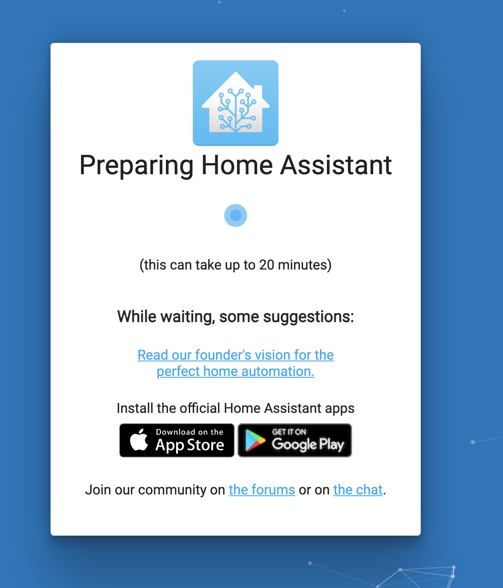
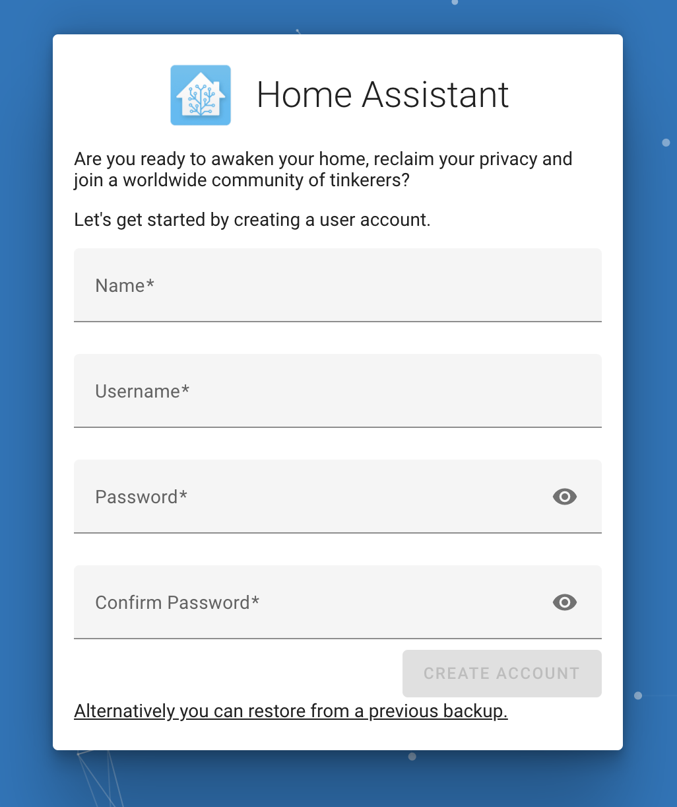
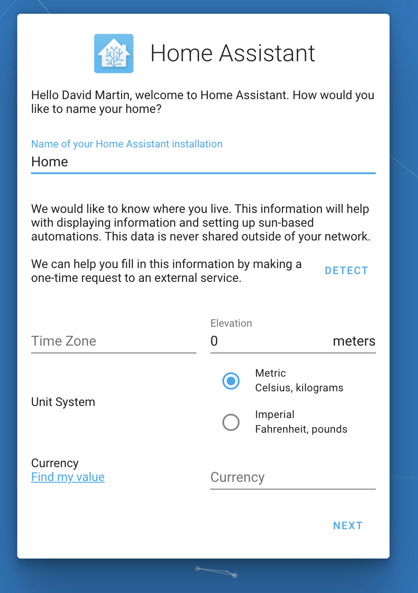
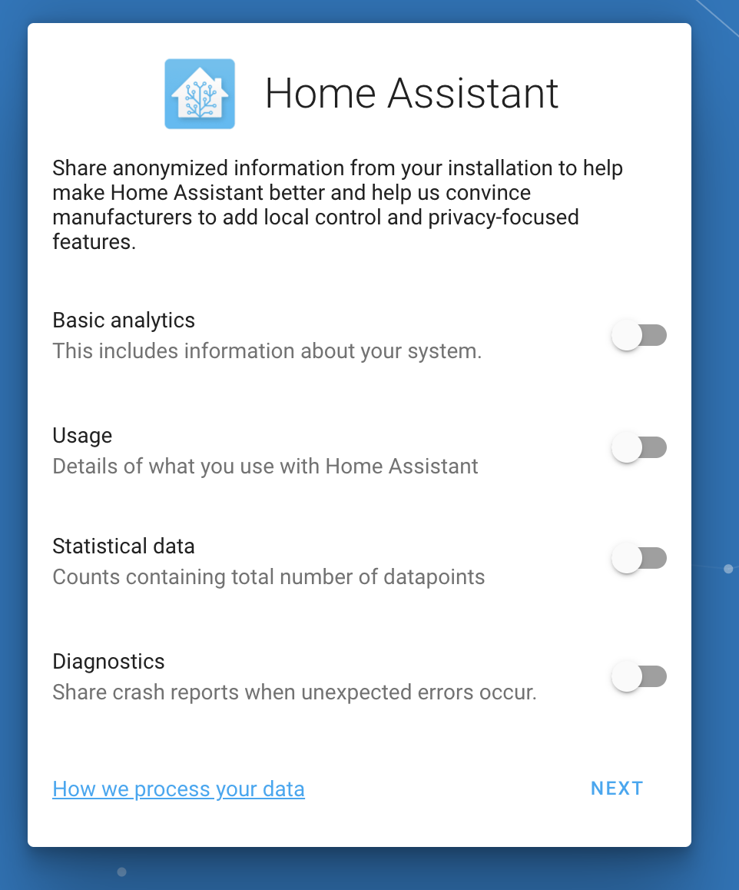
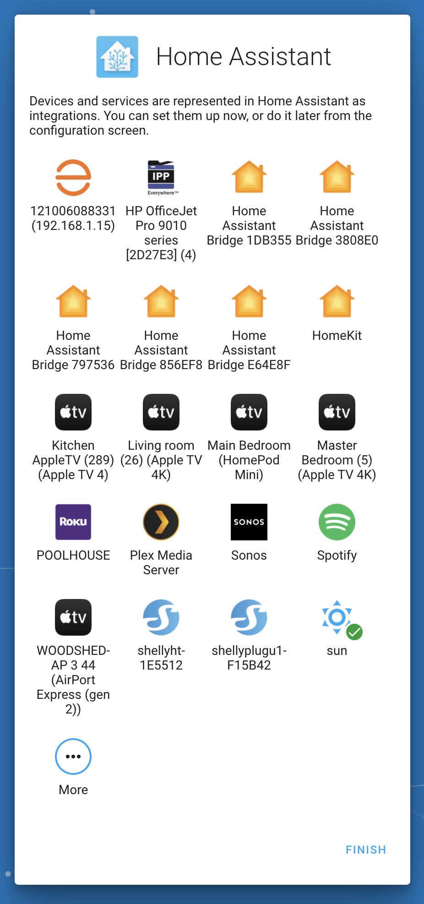
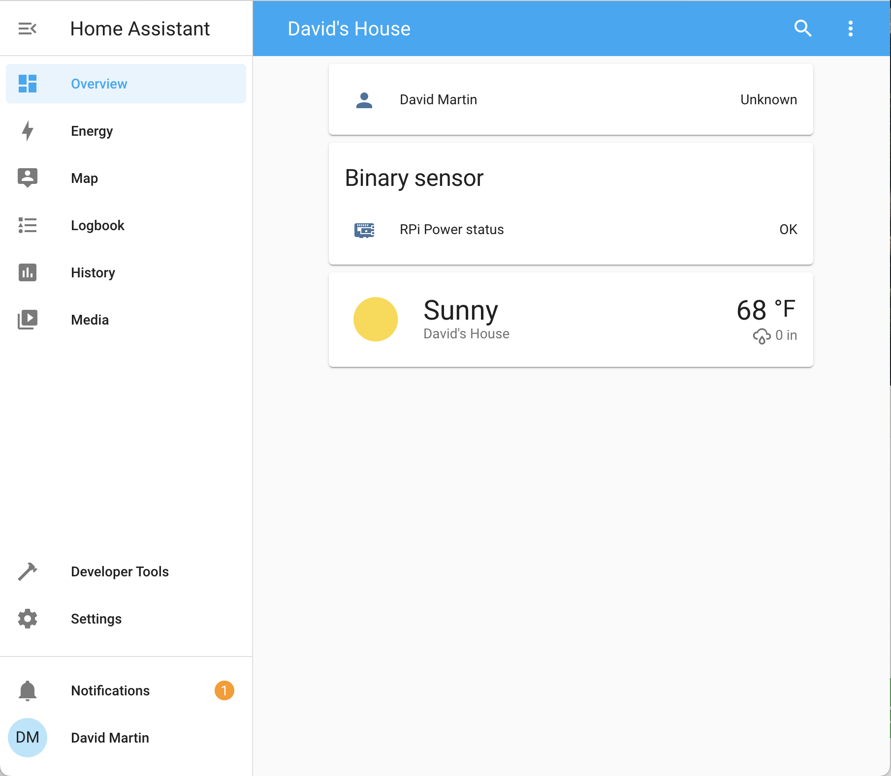
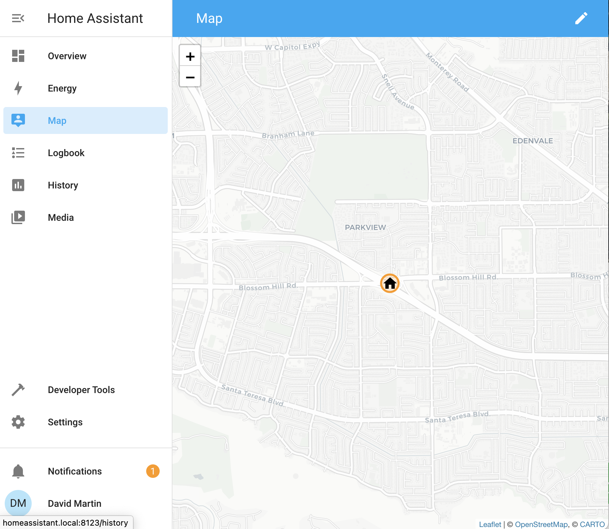
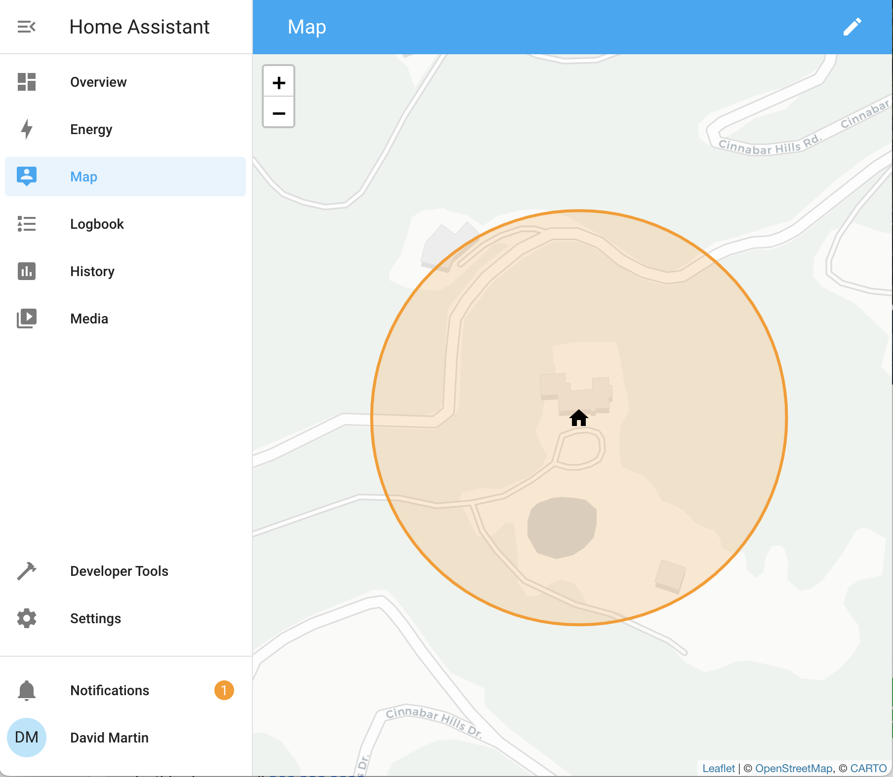
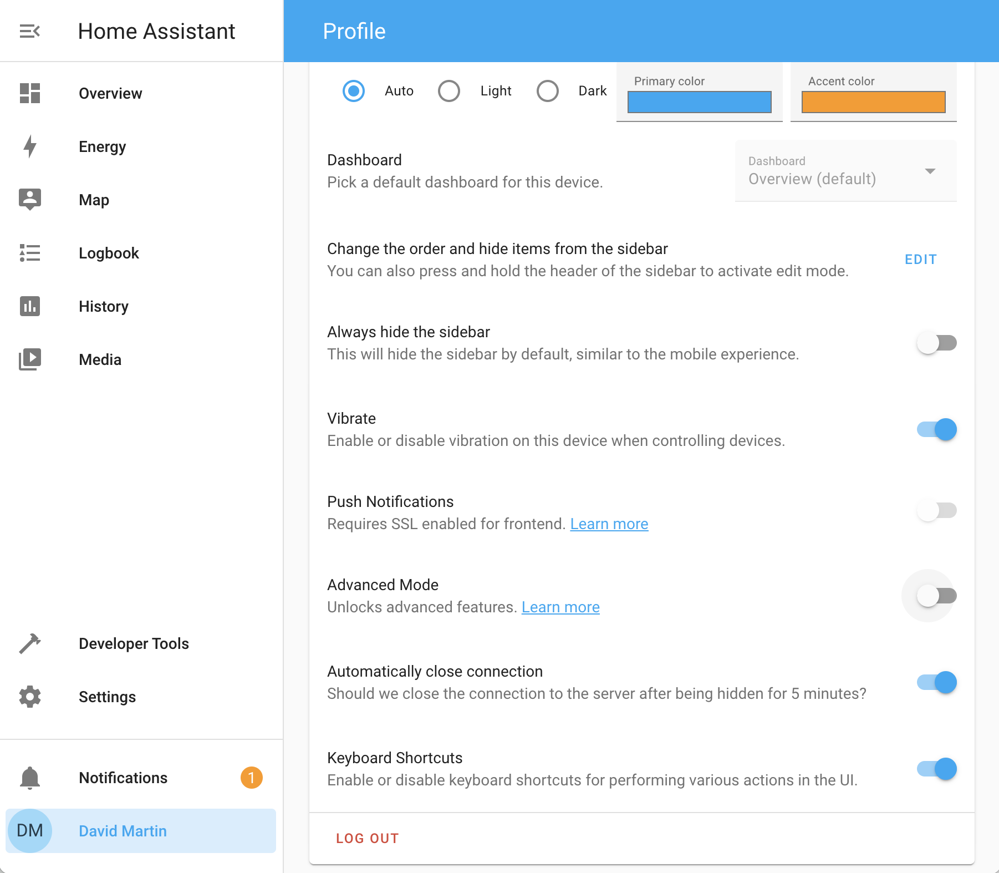

# `HOMEASSISTANT.md`

## Install Home-Assistant

Home-Assistant is required to install using the [QUICKSTART.md](QUICKSTART.md);
visit the Home-Assistant [installation page](https://www.home-assistant.io/installation/raspberrypi)
for instructions on installing the system image for a RaspberryPi 4.

### 1. Wait for initial setup

After several minutes the Home-Assistant (**HA**) server will start and indicate a _Preparing Home Assistant_ page at [http://homeassistant.local:8123/](http://homeassistant.local:8123/) similar to the image
below.

Expect to wait over 20 minutes for this step to complete.

### 2. On-boarding
The Home-Assistant setup begins with [**on-boarding**](https://www.home-assistant.io/getting-started/onboarding)
an initial user as the _owner_ as well as an _administrator_ of the system.  A prompt for that information will be presented similar to the image below.

Fill in the form with whole name (e.g. <code>John Q. Public</code>) and the system will generate a _username_ for login purposes; use the provided default or specify a preference (e.g. <code>johnqp</code>.

Provide a _password_ to control access to the account with the _username_.

Click on the create account button to complete this step.

### 3. Name and localization
The next form collects the name (default <code>Home</code>), time zone, elevation, whether metric or imperial, and currency options in a form similar to the image below.  

Pressing the <code>DETECT</code> button will utilize GPS coordinates based on your ISP's published location to automatically complete (n.b. elevation is **not** automatically detected).

Provide preferences or accept defaults and press <code>NEXT</code> to complete this step.

### D. Opt-in options

Provide preferences or accept defaults and press <code>NEXT</code> to complete this step.

### 4. Network discovery

Home-Assistant automatically discovers devices on the network and displays any found similar to the image below.  Device _integrations_ may be configured at any time.

Optionally configure integrations for discovered devices or press <code>FINISH</code> to complete this step.

## Use Home-Assistant

Home-Assistant completes setup and provides an initial minimal _dashboard_ of information similar to the image below.  The system is now ready for installation of the Age-At-Home [_add-on_](https://github.com/dcmartin/ageathome).

### 1. Panel items
The panel on the left-side of the image above provides a listing of items when selected provide alternative _dashboards_ and _controls_.

The items at the top are **dashboards** that show additional views of data (e.g. _History_); additional dashboards may be defined using the interactive editor (n.b. three vertical dots in the upper right corner).

The items at the bottom are **controls** that provide capabilities for notifications and settings. 

#### A. Notifications
The notifications panel item displays the current number of persistent nofications which are displayed when selected.  

#### B. Settings and integrations
The [**settings**](http://homeassistant.local:8123/config/dashboard) control provides access to (almost) all of the underlying system, including all options specified during setup, [_integrations_](http://homeassistant.local:8123/config/integrations) for devices and multiple [_users_](http://homeassistant.local:8123/config/person).  Home-Assistant provides redirect links to help automate the process in the browser for both [settings](https://my.home-assistant.io/redirect/config) and [integrations](https://my.home-assistant.io/redirect/integrations).

#### C. User preferences

The [**user**](http://homeassistant.local:8123/profile) control at the very bottom enables password modification and specification of experience preferences (e.g. color, currency, ..).

#### D. Map

The [**map**](http://homeassistant.local:8123/config/zone) initially reflects the GPS location utilized previously; these coordinates may require modification to indicate accurate and precise locations; associated [_zones_](https://www.home-assistant.io/integrations/zone/) and [**areas**](http://homeassistant.local:8123/config/areas/dashboard) may also be defined.

<table>
<tr><td>Automatic</td><td>Custom</td></tr>
<tr><td></td><td></td></tr>
</table>

Integrations that provide [_presence detection_](https://www.home-assistant.io/getting-started/presence-detection/) may provide GPS coordinates which may be integrated into maps.

#### E. Advanced mode
Some features of Home-Assistant are not enabled unless _advanced mode_ is selected in the user [**profile**](http://homeassistant.local:8123/profile).  These restrctions include certain add-ons, notably the [Terminal & SSH](http://homeassistant.local:8123/hassio/addon/core_ssh/info) add-on.

## Install Age-At-Home

Home-Assistant may be extended using _add-ons_ that run [Docker](http://docker.io) containers that provide a secure method of software distribution.  The [Age-At-Home](http://github.com/dcmartin/ageathome) software configures Home-Assistant with all the necessary entities and analysis required for notifications about activity, alarms and alerts -- with an updated dashboard.

Refer to [QUICKSTART.md](QUICKSTART.md) for specific instructions.

