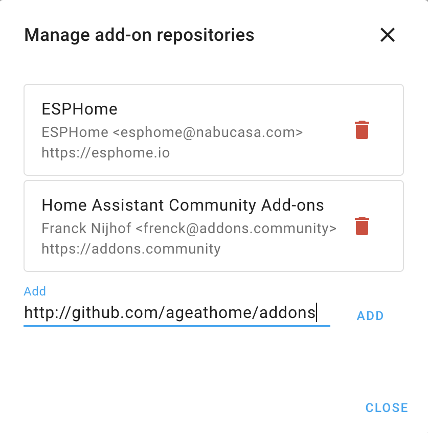

# `QUICKSTART.md` - Instructions for quick installation

# Age-At-Home installation

**Install [Home-Assistant](http://home-assistant.io) using these [instructions](HOMEASSISTANT.md)**.

## Installing the Age-At-Home add-on

The Age-At-Home add-on is installed through the [**add-on dashboard**](http://homeassistant.local:8123/hassio/dashboard) which initiallly is empty, but provides a link to the [Add-on Store](http://homeassistant.local:8123/hassio/store) similar to the image below.


The add-on container for the Age-At-Home add-on is securely distributed from the [Docker hub](http://hub.docker.com) from the open-source at [github.com/ageathome](http://github.com/ageathome)




### Commands

```
apk add make gettext sudo
git clone http://github.com/dcmartin/motion-ai /share/motion-ai
```
