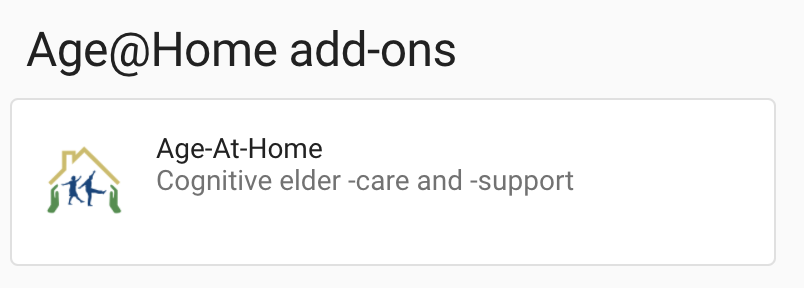

# `QUICKSTART.md`

**Install [Home-Assistant](http://home-assistant.io) using these [instructions](HOMEASSISTANT.md)** prior to installing Age@Home.

# Installing the _add-on_

The Age@Home add-on is installed through the [**add-on dashboard**](http://homeassistant.local:8123/hassio/dashboard) which initiallly is empty, but provides a link to the [**add-on store**](http://homeassistant.local:8123/hassio/store) similar to the image below.


The add-on container for the Age@Home add-on is securely distributed from the [Docker hub](https://hub.docker.com/repository/docker/dcmartin/addon-ageathome) from the open-source at [github.com/ageathome](http://github.com/ageathome)


## 1. Add the repository
The Age@Home add-on is cataloged in a [repository](http://github.com/ageathome/addons) that provides requisite information for automated deployment through Home-Assistant; see more about [_add-ons_](http://home-assistant.io/addons).

Enter the value `http://github.com/ageathome/addons` as indicated below and click `ADD`


## 2. Install the add-on

Adding the repository creates a new item in the Add-on Store similar to the image below.



Selecting the item displays `Info` and `Documentation` panels for the add-on similar to the image below.


Optionally review documentation and click on `INSTALL`

## 3. Configure and start

Once the add-on has been installed it will appear with additional panels for `Configuration` and `Log`  

Change to the `Configuration` panel and specify required information similar to the image below.


Return to the `Info` panel and enable the options for _Watchdog_, _Auto update_, and _Show in sidebar_ similar to the image above.


Start the add-on by clicking `START` on the lower-left.  After a few momenets the display should change to indicate success similar to the image below.


## 4. Restart Home-Assistant


## Commands
Here there be dragons.

```
git clone http://github.com/dcmartin/motion-ai /share/motion-ai
git clone http://github.com/ageathome/core /share/ageathome
cd /share/ageathome
ln -s /share/motion-ai .
apk add make gettext sudo
```

```
cd /share/ageathome/homeassistant
PACKAGES= make
tar chf - . | ( cd /config ; tar xf - )
ha core restart
```
